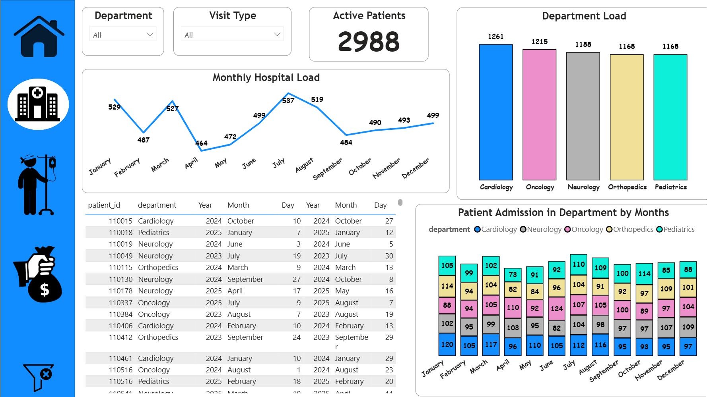
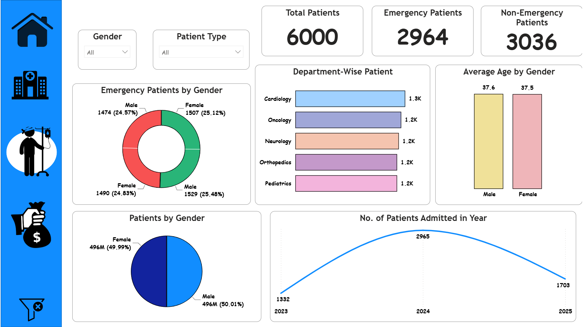
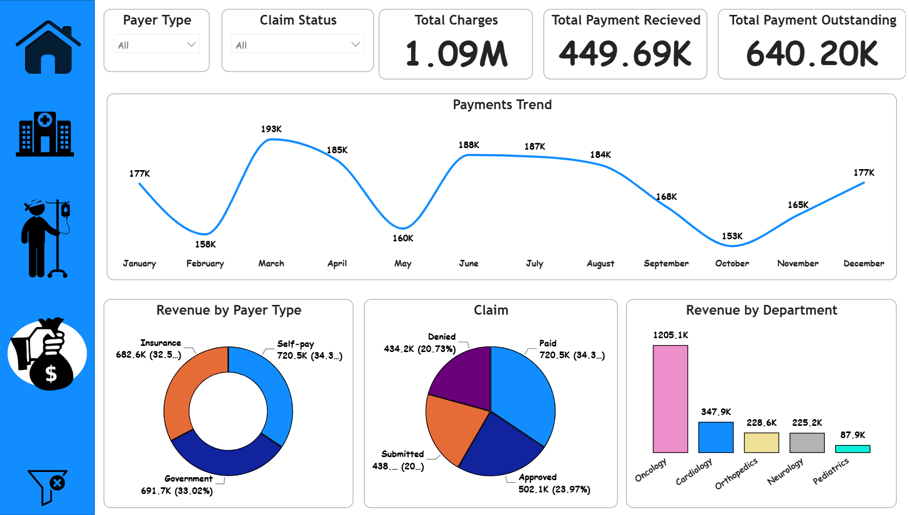

# 🏥 Hospital Analytics Dashboard | Power BI

## 📌 Project Overview

This project is an interactive Hospital Analytics Dashboard built using Power BI. It helps analyze patient information, admissions, departmental workload, and hospital financial performance through interactive visualizations.

---

## 🚀 Features

### 📊 Overall Dashboard
- Total Patients
- Emergency vs Non-Emergency Patients
- Patient Distribution by Gender
- Average Age Analysis
- Department-wise Patient Count
- Year-wise Admissions

### 👨‍⚕️ Patient Dashboard
- Active Patients
- Department Load
- Monthly Hospital Load
- Department-wise Admissions
- Admission & Discharge Details
- Interactive Filters

### 💰 Finance Dashboard
- Total Charges
- Total Payment Received
- Outstanding Payments
- Revenue by Department
- Revenue by Payer Type
- Monthly Payment Trend
- Claim Status Analysis

---

## 🛠 Tools Used

- Power BI Desktop
- Power Query
- DAX
- Data Modeling

---

## 📈 Dashboard Preview

### Overall Dashboard

### Patients Dashboard

### Finance Dashboard

---

## 📊 Skills Demonstrated

- Data Cleaning
- Data Modeling
- DAX Measures
- Interactive Dashboard Design
- Business Intelligence
- KPI Reporting
- Healthcare Analytics

---

## Dataset

This project uses a sample hospital dataset for educational and portfolio purposes.

---

## Author

Farhan Deshmukh
